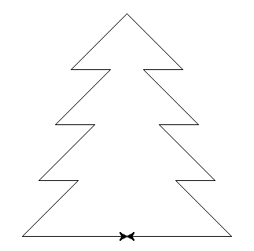

# Aufgabe 3a - Oh Tannenbaum!

In Aufgabe 1 hatten wir bereits das Haus vom Nikolaus gezeichnet.
Da es schon bald Weihnachten ist, wollen wir in dieser Aufgabe einen Tannenbaum zeichnen.

Die Schwierigkeit der Aufgabe besteht darin, nun mit zwei Schildkröten zu zeichnen.
Eine Schildkröte zeichnet den linken Umriss des Baums und die andere den rechten.
Außerdem lernst Du in dieser Übung ein neues Sprachelement kennen: Die `while` Schleife.

**Ziel:** Zeichne mittels Linien den unten abgebildeten Tannenbaum



Zunächst brauchen wir zwei Schildkröten.
In Python-Turtle ist jede Schildkröte eine **Klasse**.
Möchte man eine Schildkröte zum Zeichnen erstellen, so ruft man ein **Objekt** ins Leben.
Das Objekt basiert auf den Definitionen innerhalb der Klasse.

***
*Kleiner Exkurs in das Konzept der obejktorientierten Programmierung:*

Unsere Schildkröte hält die Eigenschaften und den Zustand fest, die sie als unseren Pinsel nutzbar macht.
Bspw. können wir den Pinsel in eine orange Farbe tunken, sodass die Borsten orange sind.
Außerdem stellt uns der Pinsel Methoden zur Nutzung bereit.
Wir können z.B. mit `forward(20)` eine gerade Linie zeichnen.
Dann ändert sich auch die Position des Pinsels auf der Leinwand.
Diese muss im Programm festgehalten werden, und zwar als neuer Zustand.

Wie in diesem Beispiel herausgestellt, versucht man mit objektorientierter Programmierung
die reale Problemstellung mittels abstrahierten Klassen auszudrücken.

Für die Bearbeitung der Aufgabe muss allerdings keine Kenntnis über die objektorientierte Programmierung vorhanden sein.
***

- Erstelle die Schildkröten und gebe ihnen jeweils einen eindeutigen Namen.
    Das Gleichheitszeichen ist eine Zuweisung zu einer Variablen (auf der linken Seite).
    Eine Variable erlaubt es uns, genau wie beim Modul `turtle`, mit einem `.` auf die Methoden zuzugreifen.

    ```python
    import turtle
    
    left_turtle = turtle.Turtle()
    right_turtle = turtle.Turtle()
    ```

- Erhöhe die Geschwindigkeit der Schildkröten, um nicht so lange auf das Ergebnis warten zu müssen:
    
    ```python
    left_turtle.speed(20)
    right_turtle.speed(20)
    ```

- Mit der `left_turle.distance(right_turtle)` Methode kann der Abstand zwischen zwei Schildkröten gemessen werden.
- Eine `while` Schleife besteht aus einer Bedingung und einem Schleifenkörper.
    Ist die Bedingung wahr, so werden die Anweisungen im Schleifenkörper ausgefürt,
    und zwar solange bis die Bedingung falsch ist.
    Aus diesem Grund sollte man immer darauf achten, dass die `while` Schleife nicht ungewollt zu einer Endloschleife wird.
    
    Hier ein Beispiel zur Nutzung der `while` Schleife:
    
    ```python
    while (turtle.xcor() <= 200):
        turtle.forward(50)
    ```

    Im Beispiel soll sich die Turtle solange um 50 Einheiten nach vorne bewegen,
    bis sie sich mindestens 200 Einheiten von der Mitte der Zeichenfläche aus bewegt hat.
- Die Schildkröten sollen wiederholt `100` Einheiten diagonal und anschließend `50` Einheiten horizontal zeichnen.
- Sind die Schildkröten mindestens `150` Einheiten voneinander entfernt, so sollen sie den Tannenbaum vollenden
    und sich genau in der Mitte treffen.
- Der Tannenbaum soll von oben nach unten gezeichnet werden.
    Fängt man unten an, so ist die Aufgabe deutlich schwerer umzusetzen!
- Das Ergebnis von Berechnungen kann als sogenannte Variable zwischengespeichert werden.
    Der Wert der Variablen kann dann wieder abgerufen werden, bspw. als Parameter in einer Methode.
    
    Beispiel:
    ```python
    doubled_distance = left_turtle.distance(right_turtle) * 2
    left_turtle.forward(doubled_distance)
    ```
    
<details>
<summary>Lösung - Tannenbaum</summary>

```python
import turtle

left_turtle = turtle.Turtle()
right_turtle = turtle.Turtle()

right_turtle.speed(10)
left_turtle.speed(10)

left_turtle.left(180)
right_turtle.right(0)
left_turtle.left(45)
right_turtle.right(45)

while left_turtle.distance(right_turtle) < 150:
    left_turtle.forward(100)
    left_turtle.left(135)
    left_turtle.forward(50)
    left_turtle.right(135)
    right_turtle.forward(100)
    right_turtle.right(135)
    right_turtle.forward(50)
    right_turtle.left(135)
    
half_distance = left_turtle.distance(right_turtle) / 2
left_turtle.left(135)
left_turtle.forward(half_distance)
right_turtle.right(135)
right_turtle.forward(half_distance)
```

</details>

# Aufgabe 3b - Zeichne den Stamm

Beim Tannenbaum fehlt noch der Stamm.

**Ziel:** Die Schildkröten sollen, bevor sie sich in der Mitte treffen, noch einmal das Rechteck für den
Baumstamm zeichnen.

<details>
<summary>Lösung - Tannenbaum mit Stamm</summary>

```python
import turtle

left_turtle = turtle.Turtle()
right_turtle = turtle.Turtle()

right_turtle.speed(20)
left_turtle.speed(20)

left_turtle.left(180)
right_turtle.right(0)
left_turtle.left(45)
right_turtle.right(45)

while left_turtle.distance(right_turtle) < 150:
    left_turtle.forward(100)
    left_turtle.left(135)
    left_turtle.forward(50)
    left_turtle.right(135)
    right_turtle.forward(100)
    right_turtle.right(135)
    right_turtle.forward(50)
    right_turtle.left(135)
    
left_turtle.left(135)
right_turtle.right(135)
left_turtle.forward(60)
right_turtle.forward(60)

left_turtle.right(90)
right_turtle.left(90)
left_turtle.forward(50)
right_turtle.forward(50)

left_turtle.left(90)
right_turtle.right(90)
half_distance = left_turtle.distance(right_turtle) / 2
left_turtle.forward(half_distance)
right_turtle.forward(half_distance)
```
</details>

# Aufgabe 3c - Den Baum schmücken

Schmücke den Baum mit Kugeln, die an den Seiten herunterängen.

**Ziel:** Nutze Kreise, um die Kugel darzustellen und eine Linie, um sie an den Baum zu hängen.

Mit `circle(10)` kann ein kompletter Kreis gezeichnet werden.
Der Kreis wird entsprechend der Ausrichtung der Schildkröte gezeichnet.
D.h., Du musst möglicherweise die Schildkröte drehen, bevor Du den Kreis zeichnest.

<details>
<summary>Lösung - Tannenbaum mit Stamm</summary>

```python
import turtle

left_turtle = turtle.Turtle()
right_turtle = turtle.Turtle()

right_turtle.speed(20)
left_turtle.speed(20)

left_turtle.left(180)
right_turtle.right(0)
left_turtle.left(45)
right_turtle.right(45)

while left_turtle.distance(right_turtle) < 150:
    left_turtle.forward(100)
    # Linke Kugel zeichnen
    left_turtle.left(45)
    left_turtle.forward(10)
    left_turtle.right(90)
    left_turtle.circle(10)
    left_turtle.right(90)
    left_turtle.forward(10)
    # Kugel gezeichnet
    left_turtle.right(90)
    left_turtle.forward(50)
    left_turtle.right(135)
    right_turtle.forward(100)
    # Rechte Kugel zeichnen
    right_turtle.right(45)
    right_turtle.forward(10)
    right_turtle.right(90)
    right_turtle.circle(10)
    right_turtle.right(90)
    right_turtle.forward(10)
    # Kugel gezeichnet
    right_turtle.left(90)
    right_turtle.forward(50)
    right_turtle.left(135)
    
left_turtle.left(135)
right_turtle.right(135)
left_turtle.forward(60)
right_turtle.forward(60)

left_turtle.right(90)
right_turtle.left(90)
left_turtle.forward(50)
right_turtle.forward(50)

left_turtle.left(90)
right_turtle.right(90)
half_distance = left_turtle.distance(right_turtle) / 2
left_turtle.forward(half_distance)
right_turtle.forward(half_distance)
```
</details>

In der [nächsten Aufgabe](A4_Kreatievuebung.md) sollst Du nun das gelernte Wissen selber anwenden und deine eigene Zeichnung erstellen.