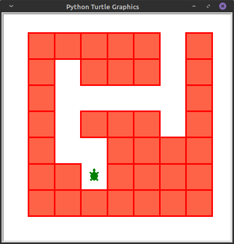

# Kreativübung

**Aufgabe:** Erstelle deine eigene Zeichnung, die am Ende vorgestellt wird.

Hier nochmal der Überblick der zuvor genutzten Funktionen inkl. weiterer Möglichkeiten:

- `forward({Schritte nach vorne})` - Bewege die Schildkröte nach vorne
- `backward({Schritte nach zurück})` - Bewege die Schildkröte zurück
- `right({Winkel})` - Drehe die Schildkröte nach rechts
- `left({Winkel})` - Drehe die Schildkröte nach links
- `pencolor({Name der Farbe auf englisch})` - Ändere die Pinselfarbe
- `penup()` - Bewege die Schildkröte ohne einen Strich zu hinterlassen
- `pendown()` - Fange nach einem Aufruf von `penup()` wieder an zu zeichnen
- `circle({Radius},{gezeichneter Winkel})` - Zeichne einen Kreis
- `speed({Geschwindigkeit})` - Ändert die Zeichengeschwindigkeit der Schildkröte

Zur Erinnerung:
Du kannst auch zwei Schildkröten erstellen, indem du sie in einer **Variable** zwischenspeicherst und von dort aus ansprichst.
Dies geht so:

```python
import turtle

# Es wird ein Object vom Typ Turtle erstellt und zwischengespeichert
turtle1 = turtle.Turtle()
turtle2 = turtle.Turtle()

turtle1.forward(100)
turtle2.backward(100)
```

## Alternative Aufgabe (Turtle Maze)

Wenn Du noch eine kleine Heraufsorderung haben möchtest, kannst Du versuchen die Turtle durch ein Labyrinth zu führen.



Um diese Aufgabe zu berarbeiten, musst Du in Repl.it folgendes tun:

1. Gehe auf das `+` Zeichen, rechts in der oberen Leiste (neben `Sign up`)
1. Reiter `Import from GitHub` anwählen
1. `https://github.com/medcross/developher-python-turtle` als repository URL eingeben.
1. Das Projekt importieren lassen
1. Im rechten oberen Bereich als `language` die Sprache `python` auswählen und als Befehl
    `python Maze/main.py`. Dann mit `done` die Konfiguarion bestätigen.
    Die gewohnte Umgebung `python (with Turtle)` funlktioniert leider nicht wie gewünscht.
